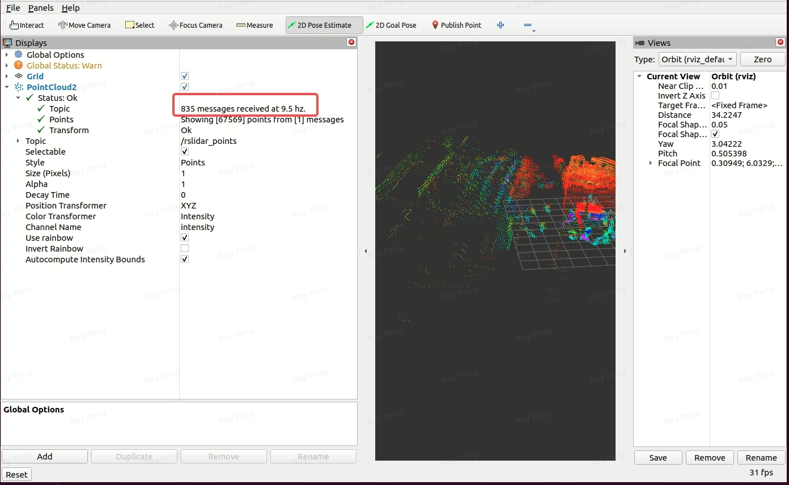

# 13 How to solve ROS2_humble frame rate drop

## 1 Node effectiveness method

This method implants the DDS installation and environment variable configuration into the startup node of the rslidar_sdk, and it only takes effect when the node is running, does not affect the global environment, is relatively friendly to environments with multiple ros versions installed, and at the same time serves to encapsulate the solution.

Place the file in the same path as other launch files and start the node in the same way as in the driver tutorial, only changing the node name to humble_start.py.

[humble_start.py](../../launch/humble_start.py)

```
ros2 launch rslidar_sdk humble_start.py
```

When the node starts up, it will prompt the user to enter the sudo password. The DDS installation will only be executed once, so there is no need to worry about repeated installations when starting the node later. For details, please refer to humble_Readme.md below.

```
#Readme#

Please put the humble_start.py file under the following directory the same as other start launch files:

/rslidar_sdk/src/rslidar_sdk/launch/
├── elequent_start.py
├── humble_start.py
├── humble_Readme.md
├── start.launch
└── start.py

After finishing the building of rslidar_sdk
use the following cmd to launch:

$ros2 launch rslidar_sdk humble_start.py$

*****
This start node is only used for ros2 humble version frame rate drop solution
It will prompt you for sudo authority to install the necessary DDS and set up new envs
The new DDS & new env variable are only effective when this node is running
Once the session is terminated, the new config should no longer be effective
```

## 2 Global change method

Running the following script will install Cyclone DDS at the system global level and configure the environment variables.

[dds_mod.sh](script/dds_mod.sh)

The usage method is as follows:

```
To run the setup script, first make sure it has execute permissions. You can do this by running the following command in your terminal:

$chmod +x dds_mod.sh$

After this, you can run the script using:

$source dds_mod.sh$
```

This script is automatically completed:

1. Install the new DDS
2. Configure environment variables

After execution is complete, delete the folder originally compiled and recompile.

## 3 Announcement

When the frame rate query result using ros2 topic hz is abnormal, it is recommended to use the built-in frame rate statistics function of rviz for viewing, or use other software to count the number of messages subscribed per second.


